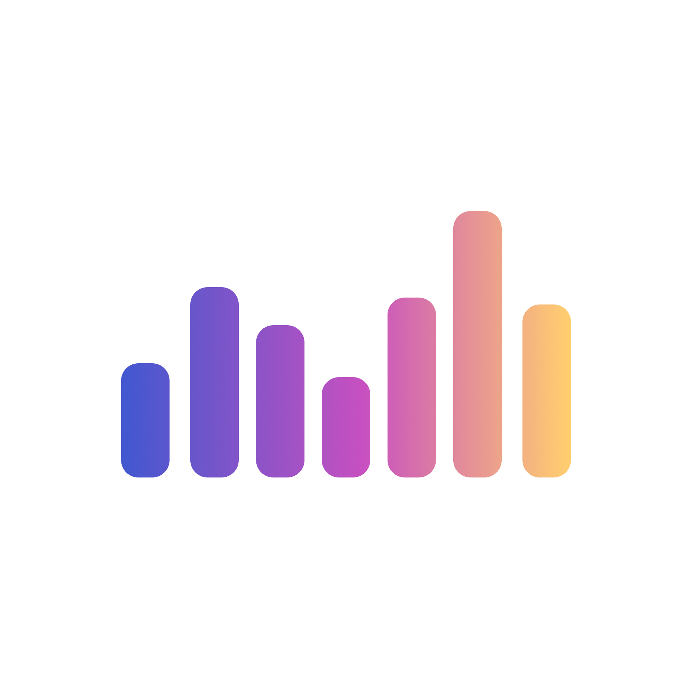
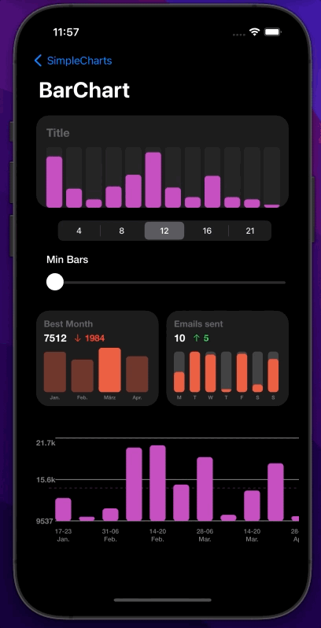
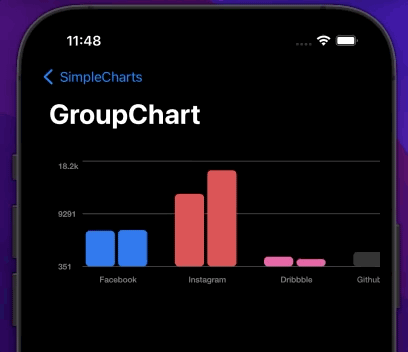
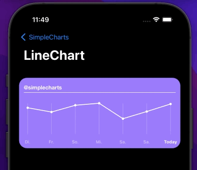

<div>


## SimpleCharts
</div>

<!--https://raw.githubusercontent.com/emrearmagan/SimpleCharts/main/SimpleChartsDemo/Assets.xcassets/AppIcon.appiconset/barchart-40@2x.png-->


----

<br>
<p>
  <samp>
A simple charting library for iOS.
  </samp>
</p>

- 📊 Bar charts
- 📚 Grouped Bar charts
- 🧮 Range Bar Charts
- 📈 Minimalistic Line chart
- 🖖 Touch events
- ✨ Bar charts are fully customizable and animated

---
### 💻 Table of contents
  1. [Quick Start](#quickStart)
      1. [Bar chart](#barChart)
      2. [Range chart](#rangeChart)
      3. [Group chart](#groupChart)
      4. [Line chart](#lineChart)
      5. [Configuring touch events](#touchEvent)
  2. [Chart options](#chartOptions)
  3. [Getting started](#gettingStarted)
  4. [Contribute](#contribute)


### Quick start <a name="quickStart"></a>

###### Bar chart: <a name="barChart"></a>
<p align="center">
  
</p>

```swift
let chart = BarChartView()
chart.setBarChartOptions([
      .showYAxis(false),
      .showXAxis(false),
      .showAvgLine(false),
      .backgroundColor(.clear),
      .showScrollIndicator(false),
      .showHorizontalLines(false),
      .isScrollable(false),
      ], barOptions: [
          .containerColor(.gray.withAlphaComponent(0.1))])

chart.entries = [
  BarEntryModel(value: 50, color: .purpleColor, label: "first"),
  BarEntryModel(value: 20, color: .purpleColor, label: "second")]

self.view.addSubview(chart)
```

###### Range chart: <a name="rangeChart"></a>
<p align="center">
  
</p>

```swift
let chart = RangeBarChartView()
chart.setBarChartOptions([
      .xAxisFont(UIFont.systemFont(ofSize: 10, weight: .medium)),
      .yAxisFont(.systemFont(ofSize: 12, weight: .bold)),
      .axisTintColor(.gray),
      .showYAxis(false),
      .showXAxis(true),
      .avgTintColor(.orange.withAlphaComponent(0.7)),
      .backgroundColor(.clear),
      .minSpacing(18),
      ], barOptions: [
          .cornerRounding(5)])

chart.entries = [
    RangeBarEntryModel(value: 20, min: 10, max: 22, color: .orange, label: "Sep."),
    RangeBarEntryModel(value: 15, min: 8, max: 30, color: .orangeColor, label: "Oct.")]

self.view.addSubview(chart)
```

###### Group chart: <a name="groupChart"></a>

<p align="center">
  
</p>

```swift
let chart = GroupedBarChartView()
chart.setGroupBarChartOptions([
      .showXAxis(true),
      .showYAxis(true),
      .showAvgLine(false),
      .showScrollIndicator(false),
      .scrollViewWidthInsets(21),
      .horizontalLineTintColor(.lightGray.withAlphaComponent(0.5)),
      .axisTintColor(.gray)]
      ,groupBarOptions: [
          .barchartOptions([
          .minBarWidth(36),
          .cornerRounding(5),
          .containerColor(.clear)]),
            .groupSpacing(30)])

chart.yAxisFormatter = { (value: Double) in
      return getShortedString(num: value)
}

chart.entries = [
    GroupedEntryModel(entries: [
        BarEntryModel(value: 5214, color: .blue, label: "Facebook"),
        BarEntryModel(value: 4541, color: .blue, label: "Facebook")], label: "Facebook"),

    GroupedEntryModel(entries: [
        BarEntryModel(value: 653, color: .darkGray, label: "Github"),
        BarEntryModel(value: 123, color: .darkGray, label: "Github")], label: "Github"),
]

self.view.addSubview(chart)
```

###### Line chart (Beta): <a name="lineChart"></a>
<p align="center">
  
</p>

```swift
let chart = LineChartView()
chart.dataPoints = [
    LineChartEntryModel(value: 105, date: Date()),
    LineChartEntryModel(value: 89, date: Date()),
]

self.view.addSubview(chart)
```

###### Configuring touch events <a name="touchEvent"></a>

To make the chart respond to touch events, implement the `BarChartDelegate` protocol in your class, e.g. a View Controller, and then set the chart’s `delegate` property:

```swift
class MyViewController: UIViewController, ChartDelegate {
  override func viewDidLoad() {
    let chart = BarChartView()
    chart.delegate = self
  }

  // Chart delegate
  func didSelect(selectedBar: Bar) {
    // Do something on touch or customize the bar
  }

  func animationDidStartFor(bar: Bar) {
    // Do something when animation started
  }

  func animationDidStopFor(bar: Bar) {
    // Do something when animation ended
  }
}
```

<!-- TODO: Add Information about Bar, BarContainer and BarContainerData -->

### Chart options <a name="chartOptions"></a>

Chart Options (Currently not supported for LineChart):

| Option Name                   | Description                                                                                                                                                                                                 |
|-------------------------------|-------------------------------------------------------------------------------------------------------------------------------------------------------------------------------------------------------------|
| `animationDuration`          | Duration of the animation for every Bar/line (`Double`, default `0.5`)                                                                                                                                                |
| `animationDelay`                   | Delay of the animation for every Bar/Line inside the Chart (`Double`, default `0`)                                                                                                                                                          |
| `showAvgLine`                 | Flag indicated whether to show the average line  (`Bool`, default `false`)
| `avgTintColor`                 | Tint of the Average line  (`UIColor`, default `.systemBlue`)
| `showHorizontalLines`                    | Flag indicated whether to show the horizontal lines (`Bool`, default `true`)
| `horizontalLineTintColor`                 | Color of the horizontal lines  (`UIColor`, default `.lightGray`)                                                                                           |
| `showYAxis`          | Flag indicated whether to show the yAxis (`Bool`, default `true`)                                                                      
| `showXAxis`          | Flag indicated whether to show the xAxis (`Bool`, default `true`)                                                                            |
| `axisTintColor`                 | Foreground color of the axis labels  (`UIColor`, default `.label`)
| `xAxisFont`                 | Font of the x-axes values (`UIFont`, default `.systemFont(ofSize: 12)`)
| `yAxisFont`                 | Font of the y-axes values (`UIFont`, default `.systemFont(ofSize: 12)`)
| `yAxisFormatter`          | Closure for formatting the y axis values (`((Double) -> String)`, default `0.5`)                                                                                                                                                  |
| `maxVisibleCount` | Maximal visible entries (`Bool?`)                                                                                         |
| `minEntryCount`                   | Minimum number of entries. If there are less  entries than specified here, a minimum amout of entries will be added (`Int?`)                                                                                                                                                          |
| `minSpacing`                  | Minimum spacing between each bar (`CGFLoat?`)                                                                                                                                                       |
| `leftSpacing`                   | Spacing for the yAxis values (`CGFLoat `, default `20 `)                                                                                                                                                                    |
| `autoFormatXAxis`                   | If set to true number of x-axis labels will be set according to width (`Bool`, default `true`)                                                                                                                                                     |
| `scrollViewWidthInsets`                        | Insets of the scrollView, only if scrollView is enabled (`CGFloat`, default `0`) |

Bar, group and range Chart:

| Option Name                   | Description                                                                                                                                                                                                 |
|-------------------------------|-------------------------------------------------------------------------------------------------------------------------------------------------------------------------------------------------------------|
| `minBarWidth`          | Minimum width of each Bar (`CGFloat?`)                                                                                                                                                |
| `markSelected`                   | Flag whether the entry should be marked as selected (`Bool`, default `true`)                                                                                                                                                          |
| `containerColor`                 | If set the barContainer will have a background color  (`UIColor?`)
| `cornerRounding`                 | Rounding of each Bar  (`CGFloat`, default `5`)
| `delegate`          | The delegate to listen to touch events (`BarChartDelegate`) |

Range Chart:

| Option Name                   | Description                                                                                                                                                                                                 |
|-------------------------------|-------------------------------------------------------------------------------------------------------------------------------------------------------------------------------------------------------------|
| `minBarAlphaValue`          | Alpha vaue for the color of the min bar (`CGFloat`, default `0.4`)                                                                                                                                                |
| `minMaxspacing`                   | Spacing between the min and max bar (`CGFloat`, default `5`) |

Group Chart:

| Option Name                   | Description                                                                                                                                                                                                 |
|-------------------------------|-------------------------------------------------------------------------------------------------------------------------------------------------------------------------------------------------------------|
| `groupSpacing`          | Spacing between each group (`CGFloat`, default `10`) |

### Installation <a name="gettingStarted"></a>

##### CocoaPods
You can use CocoaPods to install SimpleCharts by adding it to your Podfile:

    pod 'SimpleCharts'

##### Installing SimpleCharts manually <a name="manually"></a>
1. Download SimpleCharts.zip from the last release and extract its content in your project's folder.
2. From the Xcode project, choose Add Files to ... from the File menu and add the extracted files.

### Contribute <a name="contribute"></a>
Contributions are highly appreciated! To submit one:
1. Fork
2. Commit changes to a branch in your fork
3. Push your code and make a pull request
